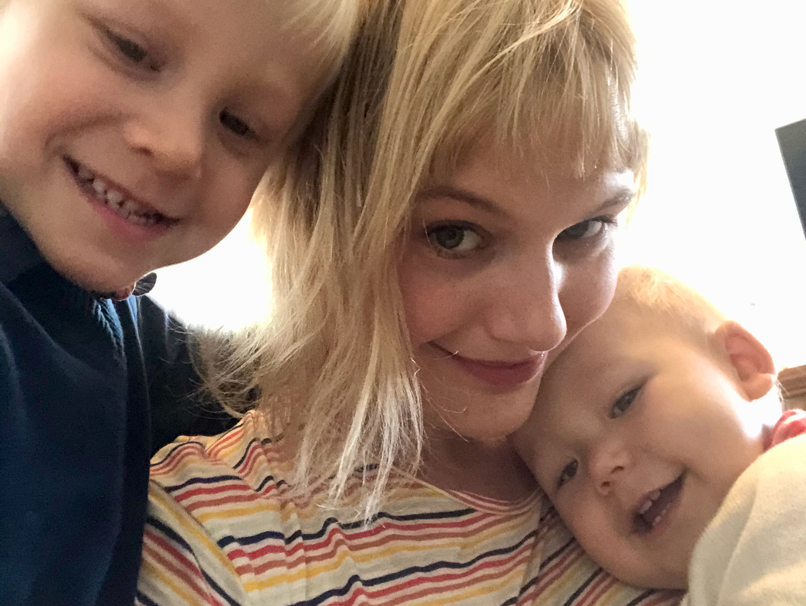

# Przedstawmy się
## Małgorzata Basińska
<!--  -->
  
[Uwielbiam spędzać czas na dociekaniach]{.smallcaps}  
[Interesuję się prawami człowieka]{.smallcaps}  
[Lubię piec ciacha i ciasteczka]{.smallcaps}  

## Jak się ze mną kontaktować
* Po zajęciach (szybko - rezerwacja sali itp.)
* Mailowo (mkbasinska@gmail.com)
* Mailowo możemy umówić się na konsultacje na Skype

# Informacje o przebiegu ćwiczeń, literaturze, zadaniach

## Cele ćwiczeń z psychometrii
::: incremental
- będziecie znać psychometryczne podstawy konstrukcji testów psychologicznych 
- będziecie potrafili ocenić własności psychometryczne testów psychologicznych
- będziecie mieć podstawy, by stwierdzić, jakie są właściwe zastosowania danego testu
- będziecie wrażliwi na zagadnienia dotyczące etycznego i uczciwego stosowania testów
- będziecie wiedzieć, **gdzie szukać informacji** na temat stosowania testów
:::

## Jak będą wyglądać zajęcia
::: incremental
- Uczenie się przez robienie
- Bądźcie przygotowani do zajęć - PROSZĘ :)
- Czytajcie literaturę
- Nie, nie zakładam, że będziecie wszystko umieć po jej przeczytaniu
- Bądźcie rządni wiedzy - zadawajcie pytania
:::

## Tak, udostępnię slajdy :)			

## Podręczniki!

## Warunki zaliczenia
- obecność na zajęciach - można nie być na jednych bez wyjaśnienia, każde następne trzeba odpracować niezależnie od okoliczności
- wysłanie **wszystkich** zadań domowych
- uzyskanie min. 60% punktów za zadania domowe

## Dostaniecie plik ze wszystkimi warunkami zaliczenia ćwiczeń, literaturą itp.

