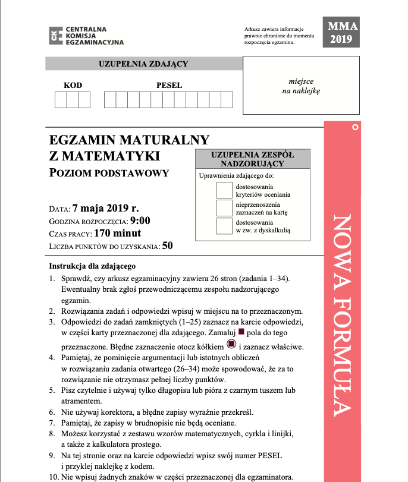

# Cel zajęć

## Po tych zajęciach będziecie wiedzieć

- co jest przedmiotem psychometrii...
- ...i po co się jej uczycie
- co to jest test psychologiczny
- jakie są kryteria dobroci testu

# Co jest przedmiotem psychometrii

## Definicja psychometrii

>Dziedzina zajmująca się opisem i mierzeniem  
>zjawisk i procesów psychicznych,  
>zwłaszcza teorią i konstrukcją  
>**narzędzi** służących do tego celu  [@Zawadzki2008]  
  
*Jak nazywa się takie narzędzie?*

## Na jakie pytania odpowie Wam dorobek psychometrii

::: incremental

- Jak odróżnić dobry test psychologiczny od złego
- Jak tworzyć testy
  - Jak konstruować pozycje testowe
  - Na jakiej podstawie spośród wielu propozycji pozycji testowych wybrać te najlepsze
  - Jak przekształcić odpowiedzi w teście na wynik testu

:::

---------------------

::: incremental

- Jak przebiega adaptacja testu stworzonego w innym języku i w innych warunkach kulturowych
- W jakim stopniu możemy z wyniku testu wyciągać wnioski na temat mierzonej cechy
- Jak dokładnie wynik testu odzwierciedla rzeczywisty poziom cechy, którą mierzy test
- Jak interpretować wyniki testów
- Jak oceniać to, czy i na ile test jest bezstronny

:::

## Naczelne pytanie psychometrii

## Dlaczego psychometria jest ważna 1

## Dlaczego psychometria jest ważna 2

# Testy psychologiczne - definicja i cechy testu psychologicznego

## Co to jest test

>**Definicja testu wg "Standardów"**  
>Narzędzie lub procedura pozwalające  
>na otrzymanie próbki zachowań osoby badanej  
>w określonej dziedzinie oraz na standaryzowany  
>sposób ich oceny lub punktacji  [@AmericanEducationalResearchAssociation2007]

## Co to jest test psychologiczny

>**Definicja testu wg S. Urbiny**  
>- Systematyczna procedura  
>- otrzymywania próbek zachowania,  
>- istotnych dla poznawczego, afektywnego  
>lub interpersonalnego funkcjonowania,  
>- oraz punktacji i oceniania tych próbek
>- zgodnie ze standardami. [@urbina2014essentials]

## Jakie są rodzaje testów @Hornowska2009

- indywidualny vs grupowy
- standaryzowany vs niestandaryzowany
- właściwości poznawyczych vs afektywnych
- słowne vs bezsłowne
- szybkości vs mocy
- obiektywne vs nieobiektywne
- zorientowane na normy vs zorientowane na kryterium

## Zadanko 1

## Czy to test psychologiczny

## Czy to test psychologiczny

  
[samequizy.pl](https://samequizy.pl/ktorymi-platkami-sniadaniowymi-jestes/)

## Zadanko 2

## Warunki, które powinien spełniać test psychologiczny

- Obiektywność
- Standaryzacja
- Rzetelność
- Trafność
- Normalizacja
- Właściwa adaptacja

## Dlaczego psychometria jest ważna raz jeszcze

---------------------

::: incremental

- Testy są jednym z podstawowych narzędzi stosowanych przez psychologa
- Psychometria pozwoli Wam odróżnić dobry test od złego
- Żaden test psychologiczny nie jest idealnym narzędziem
- Żeby odpowiedzialnie stosować testy, trzeba wiedzieć, jakie są warunki i ograniczenia ich stosowania

:::

## Warunki, które powinien spełniać test psychologiczny
  
Rudner, L. M. (1994). Questions to ask when evaluating tests. Practical Assessment, Research and Evaluation, 4(2). Retrieved from https://www.pareonline.net/getvn.asp?v=4&n=2

# Literatura

## Literatura
