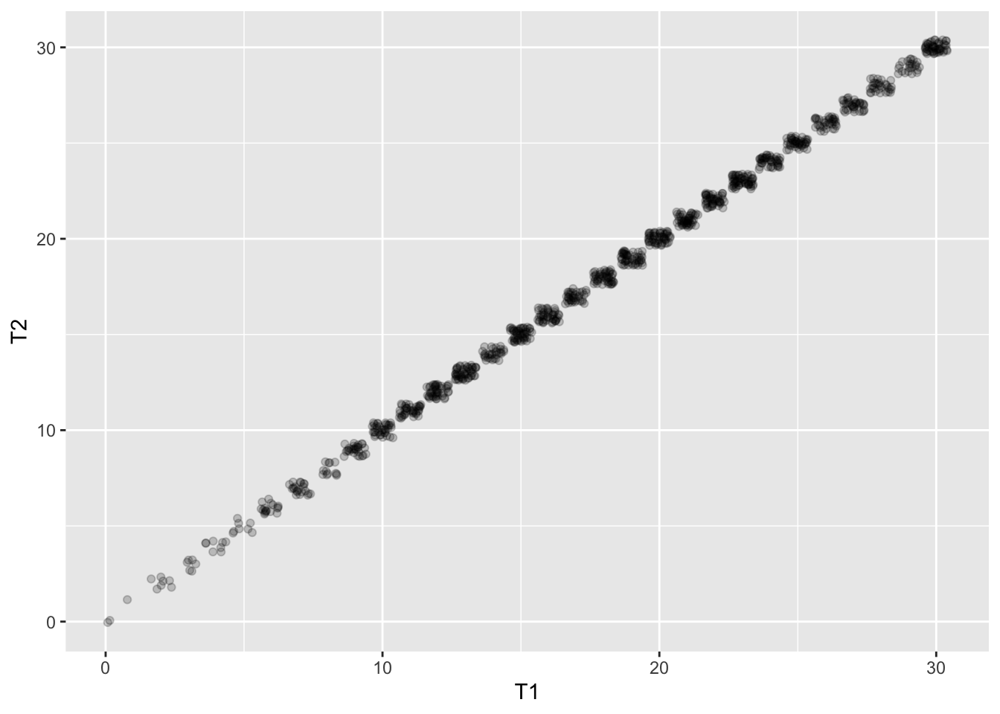
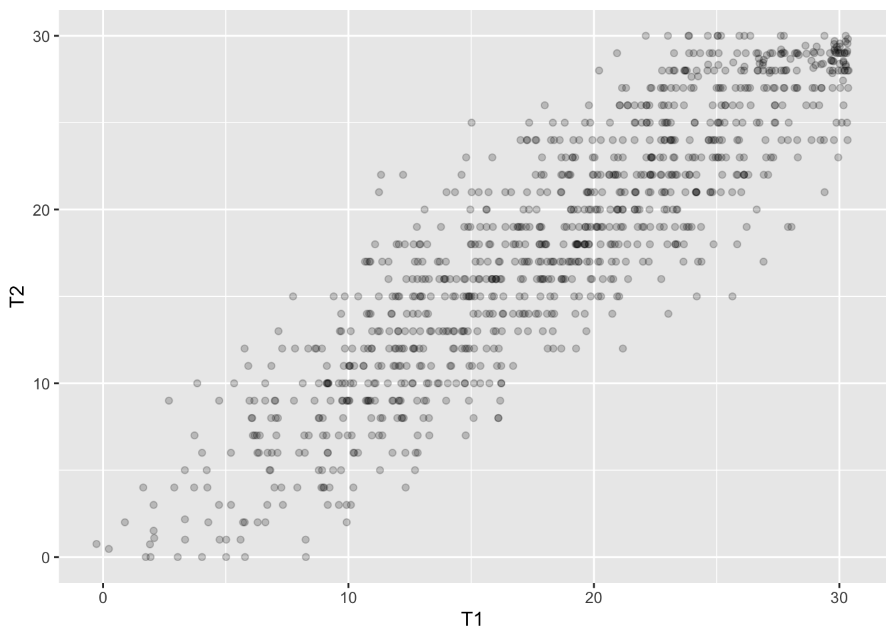
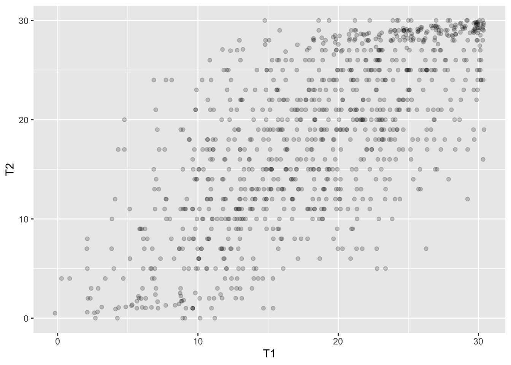
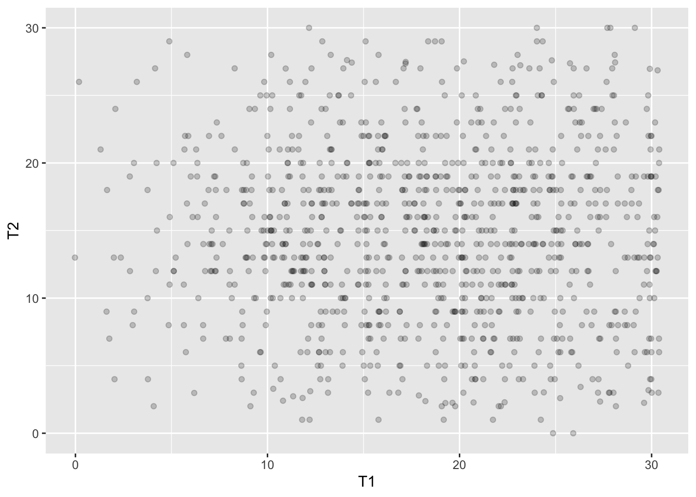

# Cel zajęć

## Po zajęciach powinniście umieć

- podać definicję rzetelności
- wytłumaczyć, o co chodzi z błędem i wynikiem prawdziwym w myśl klasycznej teorii testów
- wskazać główne źródła błędu w pomiarze testowym

## Po co nam wiedza o rzetelności?

- informacje o wynikach uzyskanych przez pacjentów/klientów w testach są nieodłączną częścią pracy psychologa
- odpowiedzialne korzystanie z takich informacji wymaga wiedzy:
	- o tym, że wynik testu nie odzwierciedla idealnie poziomu danej cechy u badanego
	- jak interpretować wynik testowe korzystając z wiedzy o rzetelności i błędzie pomiaru

------

- dzięki dorobkowi psychometrii w tym zakresie testy psychologiczne stają się coraz dokładniejszymi narzędziami pomiaru   

# Klasyczna teoria testów

## Definicja rzetelności wg S. Urbiny [@urbina2014essentials]

>**Rzetelność** to właściwość wyników testowych  
>sugerująca, że są one wystarczająco stabilne  
>i wolne od błędu pomiaru by były użyteczne.  

## Definicja rzetelności wg *Standardów* [@AmericanEducationalResearchAssociation2007]

>Stopień, w jakim wyniki testowe otrzymane dla  
>grupy osób są stabilne oraz nie zmieniają się  
>w kolejnych badaniach tym samym testem;  
>mogą być uznane za powtarzalne i rzetelne  
>dla osoby badanej; także stopień, 
>w jakim wyniki testowe są wolne  
>od błędu pomiaru dla danej grupy.

## Zadanko 1

## Pytanie

**Czy istnieje idealne narzędzie pomiarowe?**  
**Takie, które daje pomiar nieobarczony błędem?**

## Co składa się na wynik uzyskany w teście

$$X_O=X_t+X_e$$
$X_O$ - wynik obserwowany
$X_t$ - wynik prawdziwy
$X_e$ - błąd

## WYNIK PRAWDZIWY!!!!

Offical Movie Poster <a href="//en.wikipedia.org/wiki/File:Monty-Python-1975-poster.png" title="Fair use of copyrighted material in the context of Monty Python and the Holy Grail">Fair use</a>, <a href="https://en.wikipedia.org/w/index.php?curid=48315200">Link</a>

## Co to jest wynik prawdziwy - jak go sobie wyobrazić?
  
Hipotetyczny wynik idealnie odzwierciedlający poziom mierzonej cechy u osoby badanej, czytaj: nieobarczony błędem.

## Co to jest wynik prawdziwy w myśl klasycznej teorii testów

Wynik osoby badanej, gdybyśmy przebadali ją tym samym testem nieskończoną liczbę razy.
$$\infty$$

## Definicja rzetelności wzorem
$$r_{xx}=\frac{s^2_t}{s^2}$$  
$$s^2=s^2_t+s^2_e$$

## Błąd losowy vs błąd systematyczny
:::incremental
- Odkrywasz (mniejsza o to jak :)), że za każdym razem kiedy się ważysz waga dodaje 1 kg - jaki to błąd?
- Zmierzyłeś/aś wysokość swojego pokoju przykładając centymetr krawiecki do ściany. Zrobiłeś/aś to 10 razy i za każdym razem uzyskałeś trochę inny wynik - jaki to błąd?
:::

## Jak to przełożyć na testy psychologiczne?

- Nie mamy możliwości badania tej samej osoby testem w $\infty$
- Mamy za to możliwość zbadania *wielu osób*...
- I wykonania >1 (zwykle 2) pomiarów

____________

|N|T1|T2|
|-|-|-|
|1|16|17|
|2|35|34|
|3|13|10|
|..|..|..|
|n|..|..|

N - id badanego; T1 - wynik w pierwszym pomiarze; T2 - wynik w drugim pomiarze

## Przykład
- Badamy rzetelność SES Rosenberga.
- Badani wypełniają SES dwa razy w odstępie tygodnia.
- Wyniki w teście podczas pierwszego pomiaru oznaczamy jako T1.
- Wyniki w teście podczas drugiego pomiaru oznaczamy jako T2.
- *Uwaga: wyniki dla retestu w podanym przykładzie zostały wygenerowane losowo. Proszę nie traktować ich poważnie :)*

## Jak to policzymy???
Współczynnik korelacji Pearsona dla wyników pierwszego (test) i drugiego (retest) pomiaru.  
  
$$r_{tt}=\frac{\sum_{i=1}^n(\bar{t_1}-t_{1i})(\bar{t_2}-t_{2i})}{\sqrt{\sum_{i=1}^{n}(\bar{t_{1i}}-t_{1i})^2} \sqrt{\sum_{i=1}^{n}(\bar{t_2}-t_{2i})^2}}$$

## Otrzymaliśmy taki wynik

## Zadanko 2

To co widzicie na obrazkach, to korelacja wyniku w pierwszym pomiarze (podczas pierwszego wypełniania testu) z wynikiem w drugim pomiarze (podczas drugiego wypełniania testu). 

## 0 - dwa identyczne pomiary
{#id .class height=350px}  
$r_{tt}=1$

## I - dodane trochę błędu do drugiego pomiaru
{#id .class height=350px}  
$r_{tt}=0.8906881$

## II - dodane więcej błędu do drugiego pomiaru
{#id .class height=350px}  
$r_{tt}=0.7064398$

## III - całkowicie losowe wyniki w drugim pomiarze
{#id .class height=350px}  
$r_{tt}=-0.009529104$

# Źródła błędu podczas testowania

## Wynik obserwowany raz jeszcze

$$X_O=X_t+X_e$$
$X_O$ - wynik obserwowany
$X_t$ - wynik prawdziwy
$X_e$ - błąd

## Jakie są źródła błędu podczas testowania [@mcintire2007foundations][@urbina2014essentials]
:::incremental
- kontekst przeprowadzenia testu 
	- ocena testu
- osoby badane
- konstrukcja testu (test sam w sobie)
:::

## Robimy mapę myśli

# Literatura

## Literatura

