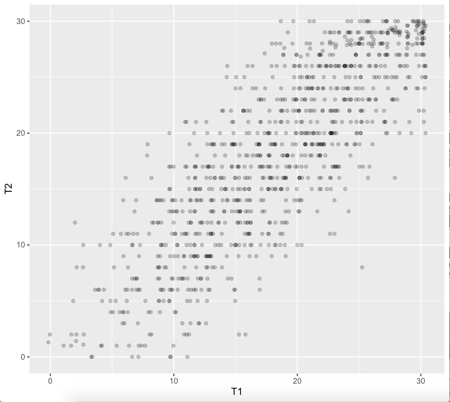

# Cel zajęć

## Po zajęciach powinniście umieć

- podać definicję rzetelności
- wytłumaczyć, o co chodzi z błędem i wynikiem prawdziwym w myśl klasycznej teorii testów
- wskazać główne źródła błędu w pomiarze testowym

## Po co nam wiedza o rzetelności

- informacje o wynikach uzyskanych przez pacjentów/klientów w testach są nieodłączną częścią pracy psychologa
- odpowiedzialne korzystanie z takich informacji wymaga wiedzy:
  - o tym, że wynik testu nie odzwierciedla idealnie poziomu danej cechy u badanego
  - jak interpretować wynik testowe korzystając z wiedzy o rzetelności i błędzie pomiaru

------

- dzięki dorobkowi psychometrii w tym zakresie testy psychologiczne stają się coraz dokładniejszymi narzędziami pomiaru

# Klasyczna teoria testów

## Definicja rzetelności wg S. Urbiny [-@urbina2014essentials]

>**Rzetelność** to właściwość wyników testowych  
>sugerująca, że są one wystarczająco stabilne  
>i wolne od błędu pomiaru by były użyteczne.  

## Definicja rzetelności wg *Standardów* [@AmericanEducationalResearchAssociation2007]

>Stopień, w jakim wyniki testowe otrzymane dla  
>grupy osób są stabilne oraz nie zmieniają się  
>w kolejnych badaniach tym samym testem;  
>mogą być uznane za powtarzalne i rzetelne dla osoby badanej;  
 także stopień, w jakim wyniki testowe są wolne  
>od błędu pomiaru dla danej grupy.

## Innymi słowy

Jeżeli zakładamy, że badamy jakąś cechę, której poziom u danej osoby jest *względnie stały w czasie* a nasz *test za każdym razem daje zupełnie inny wynik*, to taki test jest **całkowicie bezużyteczny**. 

## Pytanie

**Czy istnieje idealne narzędzie pomiarowe?**  
**Takie, które daje pomiar nieobarczony błędem?**

## Co składa się na wynik uzyskany w teście

$$X_O=X_t+X_e$$
$X_O$ - wynik obserwowany  
$X_t$ - wynik prawdziwy  
$X_e$ - błąd  

## WYNIK PRAWDZIWY

## Co to jest wynik prawdziwy - jak go sobie wyobrazić
  
Hipotetyczny wynik idealnie odzwierciedlający poziom mierzonej cechy u osoby badanej, czytaj: nieobarczony błędem.

## Co to jest wynik prawdziwy w myśl klasycznej teorii testów

Wynik osoby badanej, gdybyśmy przebadali ją tym samym testem nieskończoną liczbę razy.
$$\infty$$

## Definicja rzetelności wzorem

$$r_{xx}=\frac{s^2_t}{s^2}$$  
$$s^2=s^2_t+s^2_e$$

## Błąd losowy vs błąd systematyczny

:::incremental

- Odkrywasz (mniejsza o to jak :)), że za każdym razem kiedy się ważysz waga dodaje 1 kg - jaki to błąd?
- Zmierzyłeś/aś wysokość swojego pokoju przykładając centymetr krawiecki do ściany. Zrobiłeś/aś to 10 razy i za każdym razem uzyskałeś trochę inny wynik - jaki to błąd?

:::

## Założenia klasycznej teorii testów

- $X_O=X_t+X_e$ (na wynik obserwowany składa się wynik prawdziwy i błąd)
- Błąd ma charakter **losowy**, więc:
	- Gdybyśmy badali tę samą osobę danym testem nieskończenie wiele razy, to średni błąd wynosiłby 0
	- Korelacja błędu i wyniku prawdziwego wynosi 0
	- W dwóch kolejnych badaniach tym samym testem korelacja **błędu** wynosi zero

# Prosty przykład oceny rzetelności testu psychologicznego

## Jak to wszystko przełożyć na testy psychologiczne

- Nie mamy możliwości badania tej samej osoby testem w $\infty$
- Mamy za to możliwość zbadania *wielu osób*...
- I wykonania >1 (zwykle 2) pomiarów

---------------------------

|N|T1|T2|
|-|-|-|
|1|16|17|
|2|35|34|
|3|13|10|
|..|..|..|
|n|..|..|

N - id badanego; T1 - wynik w pierwszym pomiarze; T2 - wynik w drugim pomiarze

## Przykład

- Badamy rzetelność SES Rosenberga.
- Badani wypełniają SES dwa razy (np. w odstępie tygodnia).
- Wyniki w teście podczas pierwszego pomiaru oznaczamy jako T1.
- Wyniki w teście podczas drugiego pomiaru oznaczamy jako T2.

## Jak to policzymy

Współczynnik korelacji Pearsona dla wyników pierwszego (test) i drugiego (retest) pomiaru.  
  
$$r_{tt}=\frac{\sum_{i=1}^n(\bar{t_1}-t_{1i})(\bar{t_2}-t_{2i})}{\sqrt{\sum_{i=1}^{n}(\bar{t_{1i}}-t_{1i})^2} \sqrt{\sum_{i=1}^{n}(\bar{t_2}-t_{2i})^2}}$$

## Otrzymaliśmy taki wynik

r = 0.8241061

{#id .class height=250px}  

Jak świadczy on o rzetelności narzędzia?

# Źródła błędu podczas testowania

## Wynik obserwowany raz jeszcze

$$X_O=X_t+X_e$$
$X_O$ - wynik obserwowany  
$X_t$ - wynik prawdziwy  
$X_e$ - błąd

## Jakie są źródła błędu podczas testowania [@mcintire2007foundations; @urbina2014essentials]

:::incremental

- kontekst przeprowadzenia testu
  - ocena testu
- osoby badane
- konstrukcja testu (test sam w sobie)

:::

# Literatura

## Literatura

<small>

