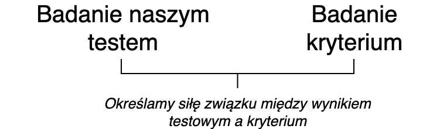

# Definicja trafności

## Definicja wg *Standardów* [@AmericanEducationalResearchAssociation2007]
>TRAFNOŚĆ to stopień, w jakim zebrane dane  
>oraz teoria uzasadniają interpretację wyników  
>testowych, zgodną z proponowanym 
>zastosowaniem testu.

## Na jakie pytania odpowiadamy mówiąc, że test jest trafny? [@mcintire2007foundations]
- Test mierzy to, co miał w założeniu mierzyć
- Test pozwala przewidzieć to, co miał w założeniu przewidywać

## Czego chcemy się dowiedzieć pytając, czy test jest trafny? Z jakich źródeł możemy czerpać wiedzę o trafności? W jaki sposób badamy trafność?

<!-- ## Źródła danych o trafności testu [AmericanEducationalResearchAssociation2007]
 -->

## Jakie są trzy strategie weryfikowania trafności testu?
:::incremental
1. Weryfikacja trafności treściowej
3. Weryfikacja trafności kryterialnej (diagnostycznej i prognostycznej)
2. Weryfikacja trafności teoretycznej
:::

## Przykłady - jaki to rodzaj trafności?
- Sprawdzamy, jak dobrze wyniki testu uzdolnień matematycznych pozwalają przewidywać osiągnięcia na studiach na politechnice.

------

- Pytamy trzech sędziów kompetentnych, w tym przypadku trzy osoby pracujące na stanowiskach menadżerskich, czy ich zdaniem zadania stworzonego przez nas testu wykorzystywanego podczas rekrutacji na stanowisko Młodszego Analityka dobrze odzwierciedlają umiejętności wykorzystywane na tym stanowisku.

-------

- Tworząc test umiejętności interpersonalnych sprawdzamy, jak jego wyniki korelują z wynikami poszczególnych podskal NEO-FFI oraz wynikami testu inteligencji.

<!-- ## Zadanko 
- jaki rodzaj trafności został zbadany?
- w jaki sposób? -->

# Trafność treściowa

## Kiedy test jest trafny treściowo?
Test jest trafny treściowo, kiedy pula jego pozycji "*stanowi **reprezentatywną** próbę dziedziny, która ma być przedmiotem pomiaru*" [@Anastasi1999] 

## W jaki sposób możemy zdefiniować uniwersum treści?
::: incremental
- przegląd badań i literatury
- przegląd testów badających ten sam konstrukt
- wywiady z ekspertami  
  
**Potrzebujemy klarownej definicji naszego uniwersum treści!**
:::

<!-- ## Definicja orientacji pozytywnej
>Pozytywna orientacja jest to podstawowa tendencja 
>do zauważania i przywiązywania wagi do pozytywnych 
>aspektów życia, doświadczeń i samego siebie. [@laguna2011orientacja]

## Definicja samooceny
>Self­-esteem (...) is a positive or negative  
>attitude toward a particular object,  
>namely, the self. [@rosenberg1965]
 -->

## Spróbujcie stworzyć definicję uniwersum treści dla PRAKTYCZNEGO EGZAMINU NA PRAWO JAZDY
Celem tego testu jest ocena umiejętności kierowania samochodem rozumianej jako...

## Dla jakich testów ocena trafności treściowej jest podstawowym źródłem danych walidacyjnych?
- testy wiadomości
- testy umiejętności
- testy osiągnięć
- testy uzdolnień

## Jak w praktyce wykorzystać wiedzę o uniwersum treści tworząc test?
1. Stworzyć specyfikację testu, w której określimy obszary treści ważne dla badanego przez nas konstruktu
2. Określić, po ile pytań stworzymy dla każdego obszaru
3. Pisząc pytania testowe musimy mieć na uwadze to, by rzeczywiście odzwierciedlały one wybrany obszar

## Jak ocenić trafność treściową po opracowaniu pozycji testowych?
$CVR = \frac{n_e - N/2}{N/2}$  
$n_e$ - liczba sędziów oceniających pozycję jako zasadniczą dla testu  
$N$ - liczba wszystkich sędziów  
W literaturze dostępne są tabele określające, czy uzyskana przez nas wartość CVR pozwala stwierdzić, że pozycja ma kluczowe znaczenie dla testu.

## Zadanko
Siedmiu sędziów (doświadczonych kierowników projektu) wypełniło ankietę dotyczącą pozycji testu wiedzy dla osób aplikujących na stanowisko Młodszego Badacza. Pięciu z nich oceniło pozycję 1 jako zasadniczą, 1 ocenił ją jako użyteczną, ale nie mającą zasadniczego znaczenia, 1 uznał, że pozycja ta nie powinna znaleźć się w obrębie testu. Czy pozycja powinna pozostać w teście?

-----  

|Liczba ekspertów|Minimalna wartość CVR|
|:-|:-|
|<=5|0.99|
|6|0.99|
|7|0.99|
|8|0.75|

# Trafność kryterialna

## Co to jest trafność kryterialna?
:::incremental
- o trafności kryterialnej mówimy wtedy, gdy "na podstawie wyników testowych wyciąga się wnioski o pozycji osoby badanej na wymiarze jakiejś innej zmiennej, nazywanej kryterium" [@AmericanEducationalResearchAssociation2007]
:::

## Dwa sposoby mierzenia trafności kryterialnej

Trafność diagnostyczna  
Trafność prognostyczna  

Jaka jest podstawowa różnica?

## Jak mierzymy trafność prognostyczną?

## Jak mierzymy trafność diagnostyczną?

## Jakie miary siły związku wykorzystujemy określając związek wyniku testowego z kryterium?
- po raz kolejny współczynnik korelacji :)
- musimy dobrać współczynnik do danych
- musimy określić, czy uzyskany przez nas współczynnik jest **istotny statystycznie**

## Problem z *ograniczeniem zakresu mierzonej cechy*
- Wyobraźcie sobie, że podczas rekrutacji kandydatów na stanowisko młodszego analityka wykorzystujemy test umiejętności analitycznych.
- Następnie część z nich jest przyjmowana do pracy, a resztę tracimy z oczu.
- Mierzymy korelację naszego testu z okresową oceną pracownika. **Co się stanie?**

<!-- ## Problem z kontaminacją kryterium -->

## Zadanko
- Zaprojektujcie badanie, które pozwoli określić **trafność diagnostyczną lub prognostyczną** podanego narzędzia. 
- *Możecie* wskazać więcej niż jedno kryterium. 
- *Musicie* wskazać, jak będziecie określać pozycję badanego na wymiarze kryterium.

---

1. test mierzący przygotowanie do małżeństwa 
2. matura z języka polskiego
3. samoopis badanego dotyczący uzależnienia od alkoholu
4. test samoopisowy dla kandydatów do pracy mierzący umiejętność pracy w grupie 

# Trafność teoretyczna

## Definicja
>Trafność teoretyczna testu to  
>stopień, w jakim mierzy on  
>konstrukt teoretyczny lub cechę.[@Anastasi1999]

## Co to jest konstrukt?
::: incremetnal
- O konstruktach możemy powiedzieć, że:
	- ich istnienie postulowane jest przez teorię
	- nie możemy obserwować lub mierzyć ich bezpośrednio
	- to co możemy obserwować, to zachowania, które są z nimi związane
:::

## Jeżeli przyjmujemy do wiadomości wyniki dotyczące trafności jakiegoś testu, zawsze robimy to w odniesieniu do DEFINICJI, jaką przyjęli autorzy testu.

## Definicja orientacji pozytywnej
>Pozytywna orientacja jest to podstawowa tendencja 
>do zauważania i przywiązywania wagi do pozytywnych 
>aspektów życia, doświadczeń i samego siebie. [@laguna2011orientacja]

## Definicja samooceny
>Self­-esteem (...) is a positive or negative  
>attitude toward a particular object,  
>namely, the self. [@rosenberg1965]

## Etapy wyjaśniania konstruktu [@mcintire2007foundations]
1. Zidentyfikuj zachowania związane z konstruktem 
2. Zidentyfikuj inne powiązane konstrukty
3. Zidentyfikuj zachowania związane z innymi konstruktami

## W jaki sposób badamy trafność teoretyczną?
::: incremental
- analiza różnic międzygrupowych
- analiza macierzy korelacji 
- *analiza czynnikowa*
- analiza struktury wewnętrznej testu
- analiza zmian nieprzypadkowych wyników testu
- *analiza procesu rozwiązywania testu*
:::

## Analiza różnic międzygrupowych
Analiza różnic międzygrupowych jest dobrym pomysłem, jeżeli teoria postuluje, że takie różnice powinny występować.

W jakich grupach przeprowadził(a)byś test, żeby zbadać jego trafność za pomocą metody analizy różnic międzygrupowych? Jeżeli uważasz, że taka metoda walidacji to w tym przypadku zły pomysł - uzasadnij.

-------

1. Test mierzący stopień uzależnienia od alkoholu
2. Test narcyzmu
3. Test psychopatii 
4. Nerdy Personality Atributes Scale

## Analiza macierzy korelacji
- aspekt zbieżny trafności
- aspekt różnicowy trafności  
  
- macierz wielu cech - 	wielu metod

<!-- ## Tu otwieramy artykuł o polskiej adaptacji SES

 -->

## Analiza struktury wewnętrznej testu

Korelacja poszczególnych pozycji testu z wynikiem ogólnym - poniżej dla testu samooceny Rosenberga:  

|P1|P2|P4|P6|P7|P3|
|-|-|-|-|-|-|
|0.76|0.73|0.66|0.81|0.79|0.79|  
  
|P5|P8|P9|P10|TOTAL|
|-|-|-|-|-|
|0.76|0.64|0.76|0.81|1.00|

## Analiza zmian nieprzypadkowych wyników testu
MANIPULACJA EKSPERYMENTALNA!!!  

Pierwszy pomiar $\to$ MANIPULACJA $\to$ Drugi pomiar

# ZADANIA DOMOWE

## Zadanie domowe 3 
1. Policz współczynnik korelacji między wynikiem w teście (pozycje Q1-Q26) a wynikiem w zmiennej "nerdy" (jedna z ostatnich kolumn). O jakim rodzaju trafności będzie mówił ten wynik? Czy świadczy o tym, że NPAS jest trafnym narzędziem? Zinterpretuj go.

------

2. Policz współczynnik korelacji między wynikiem w teście a wynikiem w podskali ekstrawersji TIPI. Żeby uzyskać wynik w skali ekstrawersji TIPI musisz zsumować wynik w zmiennej TIPI1 i odwrócony wynik w zmiennej TIPI6 (1=7, 2=6, 3=5, 4=4, 5=3, 6=2, 7=1). O jakim rodzaju trafności będzie mówił ten wynik? Czy świadczy o tym, że NPAS jest trafnym narzędziem? Zinterpretuj go.

# Literatura

## Bibliografia