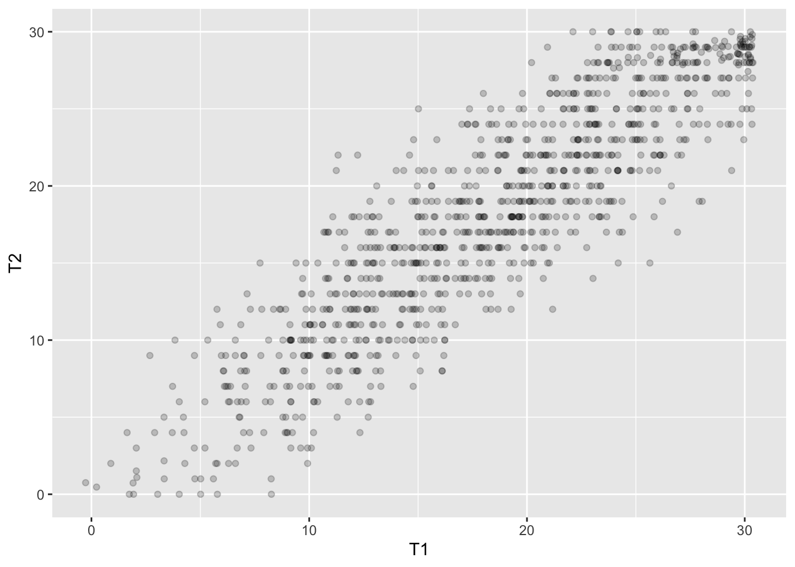

# Cel zajęć

## Po zajęciach powinniście umieć

- podać definicję rzetelności
- wytłumaczyć, o co chodzi z błędem i wynikiem prawdziwym w myśl klasycznej teorii testów
- wskazać źródła błędu w pomiarze testowym
- wskazać metodę badania rzetelności odpowiednią dla danego testu i sytuacji testowej
- obliczyć rzetelność testu z wykorzystaniem wybranych wzorów
- ocenić rzetelność indywidualnego wyniku testowego

## Plan

1. Klasyczna teoria testów - podstawy
2. Rzetelność a różnice między oceniającymi
2. Rzetelność a próbkowanie czasu: test-retest
4. Rzetelność a dobór treści
5. Rzetelność a spójność wewnętrzna testu
6. Rzetelność testów szybkości
3. Ocena rzetelności indywidualnego wyniku
8. Podsumowanie

## Po co nam wiedza o rzetelności?

- informacje o wynikach uzyskanych przez pacjentów/klientów w testach są nieodłączną częścią pracy psychologa
- odpowiedzialne korzystanie z takich informacji wymaga wiedzy:
	- o tym, że wynik testu nie odzwierciedla idealnie poziomu danej cechy u badanego
	- jak interpretować wynik testowe korzystając z wiedzy o rzetelności i błędzie pomiaru

------

- dzięki dorobkowi psychometrii w tym zakresie testy psychologiczne stają się coraz dokładniejszymi narzędziami pomiaru   

# Klasyczna teoria testów

## Definicja rzetelności wg S. Urbiny [@urbina2014essentials]

>**Rzetelność** to właściwość wyników testowych  
>sugerująca, że są one wystarczająco stabilne  
>i wolne od błędu pomiaru by były użyteczne.  

## Definicja rzetelności wg *Standardów* [@AmericanEducationalResearchAssociation2007]

>Stopień, w jakim wyniki testowe otrzymane dla  
>grupy osób są stabilne oraz nie zmieniają się  
>w kolejnych badaniach tym samym testem;  
>mogą być uznane za powtarzalne i rzetelne  
>dla osoby badanej; także stopień, 
>w jakim wyniki testowe są wolne  
>od błędu pomiaru dla danej grupy.

## Burza mózgów! 

- Czy istnieje idealne narzędzie pomiarowe?
- Idealne narzędzie pomiarowe - czyli jakie?
- Co składa się na wynik uzyskany w teście?
- Co to jest wynik prawdziwy?

## Pytanie

**Czy istnieje idealne narzędzie pomiarowe?**  
**Takie, które daje pomiar nieobarczony błędem?**

## Co składa się na wynik uzyskany w teście

$$X_O=X_t+X_e$$
$X_O$ - wynik obserwowany
$X_t$ - wynik prawdziwy
$X_e$ - błąd

## Co to jest wynik prawdziwy - jak go sobie wyobrazić?
  
Hipotetyczny wynik idealnie odzwierciedlający poziom mierzonej cechy u osoby badanej, czytaj: nieobarczony błędem.

## Co to jest wynik prawdziwy w myśl klasycznej teorii testów

Wynik osoby badanej, gdybyśmy przebadali ją tym samym testem nieskończoną liczbę razy.
$$\infty$$

## Założenia klasycznej teorii testów

- $X_O=X_t+X_e$ (na wynik obserwowany składa się wynik prawdziwy i błąd)
- Błąd ma charakter **losowy**, więc:
	- Gdybyśmy badali tę samą osobę danym testem nieskończenie wiele razy, to średni błąd wynosiłby 0
	- Korelacja błędu i wyniku prawdziwego wynosi 0
	- W dwóch kolejnych badaniach tym samym testem korelacja **błędu** wynosi zero

## Błąd losowy vs błąd systematyczny
:::incremental
- Za każdym razem kiedy się ważysz waga dodaje 1 kg - jaki to błąd?
- Zmierzyłeś wysokość swojego pokoju przykładając centymetr krawiecki do ściany. Zrobiłeś to 10 razy i za każdym razem uzyskałeś trochę inny wynik - jaki to błąd?
:::

## Definicja rzetelności wzorem
$$r_{xx}=\frac{s^2_t}{s^2}$$  
$$s^2=s^2_t+s^2_e$$

## Jakie są źródła błędu podczas testowania [@mcintire2007foundations][@urbina2014essentials]
:::incremental
- kontekst przeprowadzenia testu 
	- ocena testu
- osoby badane
- konstrukcja testu (test sam w sobie)
:::

# Rzetelność a różnice między oceniającymi

## Rzetelność a różnice między oceniającymi 
:::incremental
- **PRZYKŁAD:**
	- Test, który wymaga wprawy w ocenie - jakie znacie testy tego typu?
- **JAK OSZACOWAĆ RZETELNOŚĆ:**
	- Korelacja pomiędzy ocenami dwóch różnych sędziów
	- Kappa Cohena
:::

## Kappa Cohena
- $\kappa=\frac{p_o-p_c}{1-p_c}$
- Gdzie:
	- $p_o$ - proporcja obserwowana wystąpienia zgodnych próbek
	- $p_c$ - proporcja oczekiwana wystąpienia zgodnych próbek

## Liczymy!
- $\kappa=\frac{p_o-p_c}{1-p_c}$  
- Sędzia 1:Tak|Tak|Nie|Tak|Nie|Tak|Tak|Tak|
- Sędzia 2:Tak|Nie|Tak|Tak|Nie|Nie|Tak|Nie|

## Tabelka z liczebnościami
|       |S1 Tak|S1 Nie|
|:------|:----:|:----:|
|S2 Tak |3     |1     |
|S2 Nie |3     |1     |

## Jak to policzyć?
- proporcja odpowiedzi "tak" dla S1: 0,75
- proporcja odpowiedzi "tak" dla S2: 0,5
- proporcja oczekiwana dla zgodnych odpowiedzi "tak": 0,75 x 0,5=0,375
- proporcja oczekiwana dla zgodnych odpowiedzi "nie": 0,25 x 0,5 = 0,125
- obserwowana proporcja odpowiedzi zgodnych 0,5
- wynik: 0 (przy wartościach od -1 do 1)

## Do zastanowienia się...
- Czy współczynnik zgodności podany w podręczniku testowym będzie wyższy czy niższy od współczynnika zgodności oszacowanego dla dwóch sędziów, którzy uczą się dopiero oceniać test?

# Rzetelność a próbkowanie czasu: test-retest

## Rzetelność a próbkowanie czasu 
- **PRZYKŁAD:**
	- test badający cechę, która z założenia jest stabilna w czasie - znacie taki test?
- **JAK OSZACOWAĆ RZETELNOŚĆ:**
	- technika test-retest 
	- korelacja między wynikami dwukrotnie przeprowadzonego testu

## O co chodzi z sigmą
$\sum_{i=1}^{n} x_i$
  
Gdzie:  
n - liczebność zbioru - może to być zbiór osób badanych, pozycji testowych itp.  
$x_i$ - i-ty obiekt w zbiorze

Powyższe wyrażenie można rozwinąć tak:  
$x_1+x_2...+x_i+...+x_n$

## Inne znaczki matematyczne
$\bar{x}$ - średnia zmiennej x

## Przykład
- Badamy stabilność czasową wyników SES Rosenberga metodą test - retest.
- Wyniki w teście podczas pierwszego pomiaru oznaczamy jako T1.
- Wyniki w teście podczas drugiego pomiaru oznaczamy jako T2.
- *Uwaga: wyniki dla retestu w podanym przykładzie zostały wygenerowane losowo. Proszę nie traktować ich poważnie :)*

## Dane
|N|T1|T2|
|-|-|-|
|1|16|17|
|2|35|34|
|3|13|10|
|..|..|..|
|n|..|..|

## Jak to policzymy???
Współczynnik korelacji Pearsona dla wyników pierwszego (test) i drugiego (retest) pomiaru.  
  
$$r_{tt}=\frac{\sum_{i=1}^n(\bar{t_1}-t_{1i})(\bar{t_2}-t_{2i})}{\sqrt{\sum_{i=1}^{n}(\bar{t_{1i}}-t_{1i})^2} \sqrt{\sum_{i=1}^{n}(\bar{t_2}-t_{2i})^2}}$$

## 0 - dwa identyczne pomiary
{#id .class height=350px}  
$r_{tt}=1$

## I - dodane trochę błędu do drugiego pomiaru
{#id .class height=350px}  
$r_{tt}=0.8906881$

## II - dodane więcej błędu do drugiego pomiaru
{#id .class height=350px}  
$r_{tt}=0.7064398$

## III - całkowicie losowe wyniki w drugim pomiarze
{#id .class height=350px}  
$r_{tt}=-0.009529104$

# Rzetelność a dobór treści

## Rzetelność a dobór treści 1
- **PRZYKŁAD:**
	- test oceniający świadomość zdrowotną, przeprowadzony w grupie studentów, którzy niedawno brali udział w programie edukacyjnym dotyczącym żywienia
- **JAK OSZACOWAĆ RZETELNOŚĆ:**
	- współczynnik równoważności międzypołówkowej
	- korelacja między połówkami testu
	- ważne pytanie: jak dzielić test na połowy??

## Wzór Spearmana-Browna dla połówek testu
Do szacowania rzetelności całego testu na postawie współczynnika równoważności międzypołówkowej (korelacji między połówkami testu)
$$r_{tt}=\frac{2r_{pp}}{1+r_{pp}}$$
Gdzie:
$r_{tt}$ - rzetelność całego testu   
$r_{pp}$ - rzetelność połówek testu

## Zadanko
Współczynnik korelacji między połówkami testu wynosi 0,72. Ile wynosi rzetelność tego testu?

## Wzór Spearmana-Browna wersja ogólna
$$r_{nn}=\frac{nr_{cc}}{1+(n-1)r_{cc}}$$  
Gdzie:  
$r_{nn}$ - rzetelność testu wydłużonego **n** razy  
$r_{cc}$ - rzetelność testu, którą zmierzyliśmy  
Wartość $r_{nn}$ uzyskana ze wzoru Spearmana-Browna nigdy nie będzie większa od 1.
Kto wie dlaczego?   

## Wzór Spearmana-Browna można wykorzystać, by stwierdzić, ile razy należy wydłużyć test, aby uzyskać zakładaną rzetelność

## Rzetelność a próbkowanie treści 2
- **PRZYKŁAD:**
	- test oceniający umiejętność czytania ze zrozumieniem - niektóre fragmenty tekstu mogą być znane w danej grupie
- **JAK OSZACOWAĆ RZETELNOŚĆ:**
	- korelacja między wynikami uzyskanymi z wykorzystaniem wersji równoległych (alternatywnych)

# Rzetelność a spójność wewnętrzna testu 

## Alfa Cronbacha wygląda tak
$$\alpha=(\frac{k}{k-1})(\frac{s^2_t-\sum_{i=1}^{k}s_i^2}{s^2_t})$$  
Gdzie:  
k - liczba pozycji w teście  
$s^2_t$ - wariancja wyniku w teście  
$s_i^2$ - wariancja wyniku każdej z pozycji testowych  

## Co się dzieje w hipotetycznym teście, w którym pozycje są idealnie spójne?

____________

|n|k1|k2|k3|k4|k5|k6|
|-|-|-|-|-|-|-|
|1|1|1|1|1|1|1|
|2|2|2|2|2|2|2|
|3|3|3|3|3|3|3|
|4|4|4|4|4|4|4|
|5|1|1|1|1|1|1|
|6|1|1|1|1|1|1|

------------

1. Liczymy dla każdego badanego wynik ogólny
2. Liczymy średnią wyniku ogólnego
3. Liczymy dla każdego badanego o ile jego wynik ogólny różni się od średniej i podnosimy uzyskaną różnicę do kwadratu
4. Sumujemy kwadraty różnic i dzielimy przez liczbę badanych
5. Mamy wariancję wyniku ogólnego w teście $s_t^2$

----

1. Liczymy średnią dla pierwszej pozycji w teście
2. Liczymy dla każdego badanego o ile jego wynik w danej pozycji różni się od średniej i podnosimy uzyskaną różnicę do kwadratu
3. Sumujemy kwadraty różnic i dzielimy przez liczbę badanych
4. Mamy wariancję pierwszej pozycji w teście $s_1^2$
5. Powtarzamy dla każdej kolejnej pozycji i sumujemy uzyskane wyniki
 

## Jaka jest alfa w hipotetycznym teście, w którym pozycje są idealnie spójne?

$$\alpha=1$$ 

## Alfa dla RSE
$$\alpha = 0,91$$  
$$\bar{t} = 16,30$$  
$$s_t = 6,98$$

## Liczymy to sami
$\alpha=(\frac{k}{k-1})(\frac{s^2_t-\sum_{i=1}^{k}s_i^2}{s^2_t})$  
$s_t = 6,98$  
Liczba pozycji: 10  
SD dla poszczególnych pozycji:  

|||||
|-|-|-|-| 
|P1  0.86|P2  0.79|P4  0.81|P6  0.92| 
|P7  0.93|P3  0.95|P5  0.98|P8  0.96|  
|P9  0.99|P10 1.07|||

## Liczymy to sami 
$\alpha=(\frac{k}{k-1})(\frac{s^2_t-\sum_{i=1}^{k}s_i^2}{s^2_t})$  
$s_t = 6,98$  
Liczba pozycji: 10  
Wariancja dla poszczególnych pozycji:  

|||||
|-|-|-|-|
|P1  0.74|P2  0.62|P4  0.66|P6  0.85| 
|P7  0.86|P3  0.90|P5  0.96|P8  0.92| 
|P9  0.98|P10 1.14|

## Za co się stanie, jak dodamy przypadkowy błąd?
||$\bar{t}$|$s_t$|$\sum_{i=1}^{k}s_i^2$|$\alpha$|
|-|-|-|-|-|
||16.30|6.98|8.63|0.91|
|błąd|16.23|7.64|19.08|0.76|
|błąd*2|16.30|8.27|28.59|0.65|

## Wzór K-R20 wygląda tak
$$KR_{20}=(\frac{k}{k-1})(\frac{s^2_t-\sum_{i=1}^{q}p_i q_i}{s^2_t})$$  
Gdzie:  
k - liczba pozycji w teście  
$s^2_t$ - wariancja wyniku w teście  
$p_i$ - proporcja osób odpowiadających zgodnie z kluczem
$q_i$ - proporcja osób odpowiadających NIEzgodnie z kluczem 

# Rzetelność testów szybkości

## Jak zmierzylibyście rzetelność poniższego testu?
- test zawiera k zadań
- zadania te trzeba wykonać w czasie 5 minut
- miarą wyniku osiągniętego w teście jest liczba zadań wykonanych w ramach ustalonego limitu czasu  
**Co stałoby się, gdybyśmy podzielili test na połowy (pozycje parzyste i nieparzyste) i obliczyli rzetelność na podstawie liczby wykonanych zadań w każdej połowie?**

## Metody badania rzetelności testów szybkości
:::incremental
- Sposób pierwszy:
	- podział testu na dwie części, 
	- rozwiązywanie dwóch części osobno w dwukrotnie mniejszym limicie czasu, 
	- obliczenie korelacji liczby wykonanych zadań dla dwóch części,
	- zastosowanie wzoru Spearmana-Browna.
:::

## Metody badania rzetelności testów szybkości
:::incremental
- Sposób drugi
	- podzielenie czasu testu na 4 części,
	- dawanie badanym znaku, by po upływie każdej ćwiartki czasu zaznaczali, przy którym pytaniu są,
	- obliczenie korelacji pomiędzy liczbą zadań wykonanych dla dwóch połówek czasu, pierwszej stworzonej z 1 i 4 ćwiartki, a drugiej stworzonej z ćwiartki 2 i 3,
	- zastosowanie wzoru Spearmana-Browna.
:::

# Ocena rzetelności indywidualnego wyniku

## Standardowy błąd pomiaru
$$SEM=s_x\sqrt{1-r_{tt}}$$  
  
Gdzie:  
$s_x$ - odchylenie standardowe wyników testowych  
$r_tt$ - rzetelność testu  

## SEM ma rozkład normalny...
<!-- {#id .class height=350px}  
 -->
## ...i dlatego:
- 68% wyników mieści się w zakresie +/- 1 SD
- 90% wyników mieści się w zakresie +/- 1,64 SD
- 95% wyników mieści się w zakresie +/- 1,96 SD
- 99% wyników mieści się w zakresie +/- 2,58 SD

## Zadanko
Skonstruujcie 95% przedział ufności dla wyniku 100 w teście o odchyleniu standardowym 15 i rzetelności 0,902
$$<X-1,96 SEM, X+1,96 SEM>$$
$$SEM=s_x\sqrt{1-r_{tt}}$$ 

## Błąd standardowy różnicy między dwoma wynikami
$SE_{diff}=\sqrt{SEM_1^2+SEM_2^2}$
$SE_{diff}=\sqrt{s_{x1}^2(1-r_{tt1})+s_{x2}^2(1-r_{tt2})}$
$SE_{diff}=s_{x}\sqrt{2-r_{tt1}-r_{tt2}}$  

## $SE_{diff}$ również ma rozkład normalny
...i dlatego mamy 95% szansy, że różnica wynosząca minimum $1,96 * SE_{diff}$ jest nieprzypadkowa.  
W tym przypadku poziom ufności p wynosi $1-0.95=0.05$

## Zadanko
W teście o rzetelności 0,9 i odchyleniu standardowym 5 otrzymaliśmy u jednego badanego wynik 25 a u drugiego 35. Czy mamy prawo twierdzić, że te wyniki się różnią? Przyjmijcie p = 0.05
$SE_{diff}=s_{x}\sqrt{2-r_{tt1}-r_{tt2}}$  

# Podsumowanie

## Jak zwiększać rzetelność? [@mcintire2007foundations]
:::incremental
- dodanie pytań
- zwiększenie homogeniczności testu
- skrócenie interwału pomiędzy testem i retestem (uwaga na efekt wprawy!)
- zwiększenie efektywności przeprowadzania testu
- ostrożność podczas oceniania
- ograniczenie zgadywania lub odpowiadania nieszczerze / bez zaangażowania 
:::

## Źródła błędu a rzetelność
- niezgodność/niespójność w ocenach sędziów
- zmienność w czasie
- brak spójności wewnętrznej testu i błędy w doborze treści

## Metody szacowania rzetelności vs źródła błędu
+-----------------------+------------------------------------------+
|Źródło błędu			|Metody									   |
+:======================+:=========================================+
|Sędziowie			 	|Ocena tego samego materiału  			   |
|						|przez dwóch sędziów i obliczenie  	       |
|						|- współczynnika korelacji                 |
|						|- kappa Cohena							   |
+-----------------------+------------------------------------------+

----------

+-----------------------+------------------------------------------+
|Źródło błędu			|Metody									   |
+:======================+:=========================================+
|Zmienność w czasie		|Technika test - retest  				   |
|						|i obliczenie współczynnika korelacji  	   |
|						|między testem i retestem				   |
+-----------------------+------------------------------------------+

----------- 

+-----------------------+------------------------------------------+
|Źródło błędu			|Metody									   |
+:======================+:=========================================+
|Dobór (próbkowanie)	|Ocena korelacji między połówkami testu	   |  
|i heterogeniczność     |(pamiętaj o wzorze Spearmana-Browna)	   |
|treści					|Ocena korelacji między wersjami   		   |
|						|alternatywnymi  						   |
|						|Ocena spójności wewnętrznej  			   |
|						|- K-R20								   |
|						|- Alfa Cronbacha						   |
+-----------------------+------------------------------------------+

# Zadania

## Zadanie z artykułami!

1. Sorokowska, A., Słowińska, A., Zbieg, A., & Sorokowski, P. (2014). Polska adaptacja testu Ten Item Personality Inventory (TIPI)--TIPI-PL--wersja standardowa i internetowa.
2. Łaguna, M., Oleś, P., & Filipiuk, D. (2011). Orientacja pozytywna i jej pomiar: Polska adaptacja Skali Orientacji Pozytywnej. Studia Psychologiczne (Psychological Studies), 49(4), 47–54.
3. Łaguna, M., Lachowicz-Tabaczek, K., & Dzwonkowska, I. (2007). Skala samooceny SES Morrisa Rosenberga--polska adaptacja metody. Psychologia Społeczna, 2(02), 164–176.
4. Grygiel, P., Humenny, G., Rebisz, S., Świtaj, P., & Sikorska, J. (2013). Validating the polish adaptation of the 11-item De Jong Gierveld loneliness scale. European Journal of Psychological Assessment.

## Zadanie domowe 2
1. Policz współczynnik równoważności międzypołówkowej (pozycje testu to zmienne Q1-Q26, jak podzielić test na pół?)
2. Zastosuj na nim formułę Spearmana-Browna
3. Policz alfę Cronbacha

# Literatura

## Literatura

