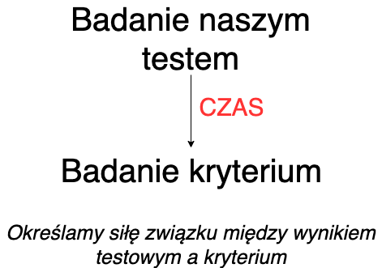

# Definicja trafności

## Definicja wg *Standardów* [@AmericanEducationalResearchAssociation2007]

>TRAFNOŚĆ to stopień, w jakim zebrane dane  
>oraz teoria uzasadniają interpretację wyników  
>testowych, zgodną z proponowanym 
>zastosowaniem testu.

## Na jakie pytania odpowiadamy mówiąc, że test jest trafny? [@mcintire2007foundations]

- Test mierzy to, co miał w założeniu mierzyć
- Test pozwala przewidzieć to, co miał w założeniu przewidywać

## Słowem przypomnienia: co to jest konstrukt

::: incremetnal

- O konstruktach możemy powiedzieć, że:
  - ich istnienie postulowane jest przez teorię
  - nie możemy obserwować lub mierzyć ich bezpośrednio
  - to co możemy obserwować, to zachowania, które są z nimi związane

:::

## Jeżeli przyjmujemy do wiadomości wyniki dotyczące trafności jakiegoś testu, zawsze robimy to w odniesieniu do DEFINICJI badanego konstruktu, jaką przyjęli autorzy testu.

## Z czego może wynikać to, że test nie jest trafny

- test nie pokrywa ważnych wymiarów konstruktu
- wynik testowy podlega procesom niezwiązanym z konstruktem

## Z jakich źródeł możemy czerpać wiedzę o trafności?

- dane, których źródłem jest treść testu
- dane oparte na analizie procesu udzielania odpowiedzi
- dane wynikające z analizy struktury wewnętrznej testu
- dane oparte na analizie związków z innymi zmiennymi
- dane oparte na konsekwencjach testowania

## Dane oparte na analizie związków z innymi zmiennymi

Analizujemy teorię dotyczącą badanego przez nas konstruktu i na jej postawie stawiamy hipotezy dotyczące tego, z jakimi zmiennymi będą związane wyniki naszego testu.

# Strategie weryfikowania trafności testu

## Jakie są trzy strategie weryfikowania trafności testu?

:::incremental

1. Weryfikacja trafności treściowej
3. Weryfikacja trafności kryterialnej (diagnostycznej i prognostycznej)
2. Weryfikacja trafności teoretycznej

:::

## Przykłady - jaki to rodzaj trafności?

- Sprawdzamy, jak dobrze wyniki testu uzdolnień matematycznych pozwalają przewidywać osiągnięcia na studiach na politechnice.

------

- Pytamy trzech sędziów kompetentnych, w tym przypadku trzy osoby pracujące na stanowiskach menadżerskich, czy ich zdaniem zadania stworzonego przez nas testu wykorzystywanego podczas rekrutacji na stanowisko Młodszego Analityka dobrze odzwierciedlają umiejętności wykorzystywane na tym stanowisku.

-------

- Tworząc test kompetencji interpersonalnych sprawdzamy, jak jego wyniki korelują z wynikami PROKOS – Profil Kompetencji Społecznych oraz wynikami testu inteligencji.

# Trafność treściowa

## Kiedy test jest trafny treściowo?
Test jest trafny treściowo, kiedy pula jego pozycji "*stanowi **reprezentatywną** próbę dziedziny, która ma być przedmiotem pomiaru*" [@Anastasi1999] 

## W jaki sposób możemy zdefiniować uniwersum treści?

- przegląd badań i literatury
- przegląd testów badających ten sam konstrukt
- wywiady z ekspertami  

--------------------  

**Potrzebujemy klarownej definicji naszego uniwersum treści!**
**Nasza definicja powinna poddawać się operacjonalizacji**

## Przykłady definicji 1

>Pozytywna orientacja jest to podstawowa tendencja 
>do zauważania i przywiązywania wagi do pozytywnych 
>aspektów życia, doświadczeń i samego siebie. [@laguna2011orientacja]

## Przykład definicji 2

>Self-esteem (...) is a positive or negative  
>attitude toward a particular object,  
>namely, the self. [@rosenberg1965]

## Dla jakich testów ocena trafności treściowej jest podstawowym źródłem danych walidacyjnych?

- testy wiadomości
- testy umiejętności
- testy osiągnięć
- testy uzdolnień

## Jak w praktyce wykorzystać wiedzę o uniwersum treści tworząc test?

1. Stworzyć specyfikację testu, w której określimy obszary treści ważne dla badanego przez nas konstruktu
2. Określić, po ile pytań stworzymy dla każdego obszaru
3. Pisząc pytania testowe musimy mieć na uwadze to, by rzeczywiście odzwierciedlały one wybrany obszar

## Jak ocenić trafność treściową po opracowaniu pozycji testowych?

$$CVR = \frac{n_e - N/2}{N/2}$$    
$n_e$ - liczba sędziów oceniających pozycję jako zasadniczą dla testu  
$N$ - liczba wszystkich sędziów  
W literaturze dostępne są tabele określające, czy uzyskana przez nas wartość CVR pozwala stwierdzić, że pozycja ma kluczowe znaczenie dla testu.

## Zadanko :)

- Na podstawie wstępu do artykułu postarajcie się opisać uniwersum treści testu, którego dotyczy artykuł.
- Oprócz definicji podajcie kilka konkretnych obszarów, w których mogą przejawiać się zachowania związane z konstruktem.
- Dla każdego z tych obszarów postarajcie się określić 1-2 pozycje testowe (zapiszcie je).
- Zamieńcie się kartkami z zapisanymi pozycjami i przedyskutujcie, czy Waszym zdaniem pozycje stworzone przez drugą grupę są zasadnicze dla testu. 

--

- Obejrzyjcie oryginalną wersję testu i zobaczcie, jak ma się do Waszych propozycji.

# Trafność kryterialna

## Co to jest trafność kryterialna?

:::incremental

- o trafności kryterialnej mówimy wtedy, gdy "na podstawie wyników testowych wyciąga się wnioski o pozycji osoby badanej na wymiarze jakiejś innej zmiennej, nazywanej kryterium" [@AmericanEducationalResearchAssociation2007]

:::

## Dwa sposoby mierzenia trafności kryterialnej

Trafność diagnostyczna  
Trafność prognostyczna  

Jaka jest podstawowa różnica?

## Jak mierzymy trafność prognostyczną? {data-background-color="white"}

## Jak mierzymy trafność diagnostyczną?

## Jakie miary siły związku wykorzystujemy określając związek wyniku testowego z kryterium?

- po raz kolejny współczynnik korelacji :)
- musimy dobrać współczynnik do danych
- musimy określić, czy uzyskany przez nas współczynnik jest **istotny statystycznie**

## Problem z *ograniczeniem zakresu mierzonej cechy*

- Wyobraźcie sobie, że podczas rekrutacji kandydatów na stanowisko młodszego analityka wykorzystujemy test umiejętności analitycznych.
- Następnie część z nich jest przyjmowana do pracy, a resztę tracimy z oczu.
- Mierzymy korelację naszego testu z okresową oceną pracownika. **Co się stanie?**

## Zadanko :)

- Na podstawie opisu, który usłyszycie określcie:
  + czy macie do czynienia z trafnością diagnostyczną, czy prognostyczną,
  + jaki jest predyktor (zmienna mierzona przez test, który badacie),
  + jakie jest kryterium,
  + jaki jest współczynnik trafności i jak go oceniacie.

## Literatura

<small>