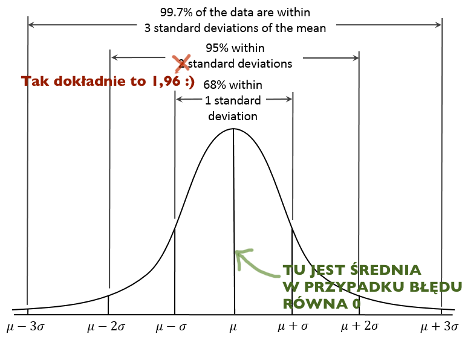

# Ocena rzetelności indywidualnego wyniku

## Standardowy błąd pomiaru
$$SEM=s_x\sqrt{1-r_{tt}}$$  
  
Gdzie:  
$s_x$ - odchylenie standardowe wyników testowych  
$r_tt$ - rzetelność testu  

## SEM ma rozkład normalny...
<!-- {#id .class height=350px}  
 -->
## ...i dlatego:
- 68% wyników mieści się w zakresie +/- 1 SD
- 90% wyników mieści się w zakresie +/- 1,64 SD
- 95% wyników mieści się w zakresie +/- 1,96 SD
- 99% wyników mieści się w zakresie +/- 2,58 SD

## Zadanko
Skonstruujcie 95% przedział ufności dla wyniku 100 w teście o odchyleniu standardowym 15 i rzetelności 0,902
$$<X-1,96 SEM, X+1,96 SEM>$$
$$SEM=s_x\sqrt{1-r_{tt}}$$ 

## Błąd standardowy różnicy między dwoma wynikami
$SE_{diff}=\sqrt{SEM_1^2+SEM_2^2}$
$SE_{diff}=\sqrt{s_{x1}^2(1-r_{tt1})+s_{x2}^2(1-r_{tt2})}$
$SE_{diff}=s_{x}\sqrt{2-r_{tt1}-r_{tt2}}$  

## $SE_{diff}$ również ma rozkład normalny
...i dlatego mamy 95% szansy, że różnica wynosząca minimum $1,96 * SE_{diff}$ jest nieprzypadkowa.  
W tym przypadku poziom ufności p wynosi $1-0.95=0.05$

## Zadanko
W teście o rzetelności 0,9 i odchyleniu standardowym 5 otrzymaliśmy u jednego badanego wynik 25 a u drugiego 35. Czy mamy prawo twierdzić, że te wyniki się różnią? Przyjmijcie p = 0.05
$SE_{diff}=s_{x}\sqrt{2-r_{tt1}-r_{tt2}}$  